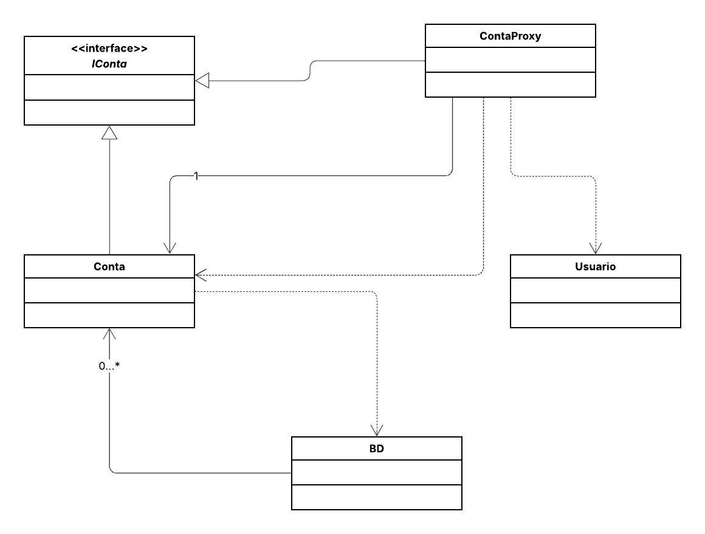

## 🏦 Sistema de Controle Bancário

Este projeto implementa o padrão de projeto estrutural **Proxy**.
O objetivo é criar um intermediário (`ContaProxy`) que controla o acesso ao objeto real (`Conta`), adicionando uma camada de segurança e otimização de recursos sem alterar a lógica de negócios principal.

O projeto aplica o princípio de **Single Responsibility** (Responsabilidade Única) e **Open/Closed**, permitindo:

1.  **Proteção (Protection Proxy):** Apenas usuários com perfil de `Gerente` podem acessar métodos sensíveis, como `consultarValores` (saldo e limite).
2.  **Carregamento sob Demanda (Virtual Proxy):** O objeto pesado `Conta` (que simula uma busca no Banco de Dados) só é instanciado quando seus dados são realmente requisitados, economizando memória e processamento.

## 📌 Diagrama de Classes

## 👩‍💻 Autora

**Eduarda Araujo Carvalho**
